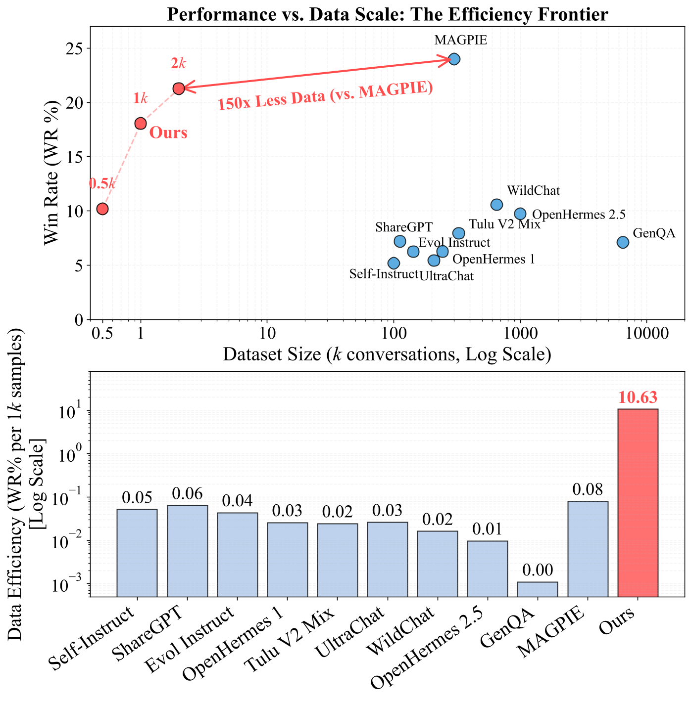

# Less is Enough: Synthesizing Diverse Data in Feature Space of LLMs

This is the official implementation of the paper: `Less is Enough: Synthesizing Diverse Data in Feature Space of LLMs`.

---

## Core Insight

✨ **Work smarter, not harder.**

In the post-training stage of LLMs, instead of blindly adding massive amounts of surface-level diverse text, it is more effective to precisely identify and synthesize those **truly missing key features**. With only a small number of targeted synthetic samples, we can significantly fill the gaps in **Feature Activation Coverage (FAC)**, leading to clear performance improvements on downstream tasks.

### Why is this insight simple yet powerful?

Traditional data synthesis focuses on quantity and surface diversity (vocabulary, sentence patterns, topic distribution), but these are often just **weak proxies**. What truly determines a model's downstream performance is **the coverage of key features required by the target task**.

Our work reveals:

- Many texts that "appear very different" actually activate highly overlapping features;
- **FAC** predicts downstream performance much better than standard diversity metrics, including **Distinct-1/2** and **n-gram Entropy** at the word level, **POS-tag Distinct-2** at the syntax level, and **Pair CosDist** and **Semantic Entropy** at the embedding level.  
- For instruction following, **FAC Synthesis** achieves performance comparable to the prior SOTA **MAGPIE**, while requiring **150× less data** than MAGPIE.

<p align="center">
  
</p>

<p align="center">
  <b>Figure 1:</b> The Efficiency Frontier of Instruction Following Datasets. Our proposed method achieves a Win Rate on AlpacaEval 2.0 comparable to MAGPIE while using only 2K synthetic samples (vs. 300K for MAGPIE).
</p>

---

## Getting Started

### Installation

```bash
git clone https://anonymous.4open.science/r/Anonymous_1196
cd Anonymous_1196
pip install -r requirements.txt
```

---

### Repository Structure

```text
FAC-Synthesis/
├── LICENSE
├── README.md
├── requirements.txt
│
├── sae_pretrain/                 # SAE pretraining
│   ├── datasets/                 # pretraining corpora (constructed from public sources)
│   └── outputs/                  # SAE pre-trained weights
│
├── sae_feature_analysis/         # SAE feature analysis pipeline
│   ├── interpret_features/       # feature interpretation (span collection + annotation)
│   ├── identify_task_relevant_features/   # task-relevant feature identification
│   └── identify_missing_features/         # missing-feature discovery (coverage gap)
│
├── fac_synthesis/                # FAC synthesis pipeline
│   ├── step1_contrastive_pair_construction/      # Step-1: contrastive pair construction
│   └── step2_feature_covered_sample_synthesis/   # Step-2: feature-covered synthesis
│
└── training_scripts/             # Downstream training / evaluation scripts
    ├── toxicity_detection/
    ├── reward_modeling/
    ├── instruction_following/
    └── behavior_steering/
```

### Pre-training Sparse Autoencoders
Most of the scripts for SAE pretraining are located in `sae_pretrain/`. To pre-train SAEs, run the following commands:

```bash
```bash
# Step-1: Collect hidden activations from the backbone LLM (e.g., layer 16)
python create_actvs_uni.py 0 0 1 meta-llama/Llama-3.1-8B-Instruct 16

# Step-2: Train SAEs on the target layer (e.g., layer 16)
python train_SAEs.py 0 16 meta-llama/Llama-3.1-8B-Instruct /sae_input/prompt_actvs_l16
```

### Analyzing the features of SAE
Feature analysis scripts are located in `sae_feature_analysis/`. To group activation spans and generate human-readable feature interpretations, run:

```bash
# Step-1: Group extracted activation spans
python groupby_textspans.py /xxx/threshold_0.0

# Step-2: Annotate feature explanations based on grouped spans
python annotate_explanations.py /xxx/threshold_0.0.tsv

# Step-3: Identify task-relevant features from the explanations
python annotate_toxicity.py /xxx/threshold_0.0_explained.tsv

# Step-4: Identify missing features via FAC analysis
python identify_fac.py anchor_features.tsv (complete) task_features.tsv (currently available)
```

### Coverage-guided data synthesis
Coverage-guided synthesis scripts are located in fac_synthesis/. To generate synthetic queries, run

```bash
# Step-1 (1): Contrastive Pair Construction
python generate_data_llama_r1.py \
  --features xxx.tsv \
  --out xxx \
  --temperature 0.8
# Step-1 (2): Feature-Covered Sample Synthesis
python analyze_step1_synthetic_data.py
python merge_step1_failed_cases.py

# Step-2: Feature-Covered Sample Synthesis
python generate_data_llama_r2.py \
  --features xxx.tsv \
  --out xxx \
  --temperature 0.8
```

---

## Acknowledgements

In the evaluation stage, our downstream training and testing scripts are adapted from the following open-source repositories:

- [RLHF-Reward-Modeling](https://github.com/RLHFlow/RLHF-Reward-Modeling)
- [CAA](https://github.com/nrimsky/CAA)
- [LLaMAFactory](https://github.com/hiyouga/LLaMAFactory)

---

## Citation

If you use this repository, please cite:

```bibtex
@inproceedings{fac_synthesis_2026,
  title     = {FAC-Synthesis},
  author    = {Anonymous Authors},
  booktitle = {International Conference on Machine Learning (ICML)},
  year      = {2026}
}
```
